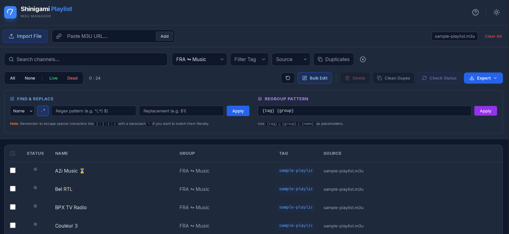

# Shinigami Playlist


    
**The Client-Side M3U Manager.**

Shinigami Playlist is a modern, privacy-first web application designed to help you manage, clean, and organize your IPTV playlists directly in your browser. No backend server, no data uploads, no AI—just you and your media.

**Screenshot**



## Key Features

*   **100% Client-Side:** Your playlists never leave your device. All processing happens locally in your browser.
*   **Multi-Source Import:** Combine local `.m3u` files and remote URLs into a single unified list.
*   **Smart Filtering:**
    *   Filter by Group, Tag, Source, or Status.
    *   **Combobox Inputs:** Type to search or select from existing tags/groups.
    *   **Duplicate Detection:** One-click filter to find and handle duplicate streams.
*   **Sorting & Organization:**
    *   **Bulk Sort:** Click column headers (Name, Group, Tag) to sort A-Z or Z-A.
    *   **Manual Reordering:** Drag and drop channels using the grip handle to arrange specific orders.
*   **Bulk Editing:**
    *   **Find & Replace:** Standard text replacement or powerful **Regex** (Regular Expressions) with capture groups.
    *   **Regrouping:** Standardize your channel groups using dynamic patterns (e.g., `{tag} > {group}`).
*   **Quality Control:**
    *   **Link Checker:** Verify if channels are Live (Green) or Dead (Red). Select Dead or Live channels.
    *   **Mixed Content Protection:** Smart handling of HTTP streams on HTTPS connections.
    *   **Deduplication:** One-click removal of duplicate stream URLs.
*   **Undo System:** Made a mistake? The robust Undo history tracks your last 10 major actions.
*   **Export:** Save your curated list as `.m3u` or `.m3u8`, exporting everything or just your selection.

## Tech Stack

*   **Frontend:** React 18, TypeScript
*   **Styling:** Tailwind CSS (Local)
*   **Icons:** Lucide React
*   **Build:** Vite

## Installation & Setup

Follow these steps to get the app running locally on your machine.

### 1. Clone the Repository
Clone the project code from GitHub to your local computer.
```bash
git clone https://github.com/wmahfoudh/shinigami-playlist.git
cd shinigami-playlist
```

### 2. Install Dependencies
Install the required packages (React, Vite, Tailwind, etc.) defined in `package.json`.
```bash
npm install
```

### 3. Run Development Server
Start the local Vite server.
```bash
npm run dev
```
Once started, open the URL shown in your terminal (usually `http://localhost:5173`) in your browser.

### 4. Build for Production (Optional)
To build the application for deployment (creates a `dist` folder):
```bash
npm run build
```

## How to Use

1.  **Import:** Click "Import File" or paste a URL to load channels.
2.  **Filter:** Use the top bar to find specific channels. Use the "Duplicates" button to clean up your list.
3.  **Sort:** Click column headers to sort alphabetically, or drag the handle on the right of any row to reorder manually.
4.  **Edit:** 
    *   Click "Bulk Edit" to open the tools panel.
    *   Use **Find & Replace** to clean up messy channel names.
    *   Use **Regroup Pattern** to organize and rename groups.
5.  **Check:** Select channels and click "Check Status" to ping the servers.
6.  **Export:** Click "Export" to download your finished playlist.

## ⚡ Pro Tips

*   **Regex Mode:** Click the `.*` button in Bulk Edit.
    *   *Example:* Convert `[US] CNN` to `CNN`
    *   *Find:* `\[US\] (.*)`
    *   *Replace:* `$1`
*   **Undo:** The circular arrow button undoes the last major action (Import, Delete, Bulk Edit).
*   Please note that the performance depends heavily on the number of channels and your configuration.
